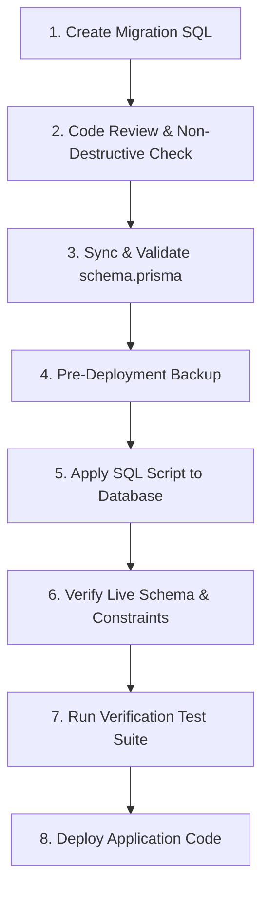

# Database Migration & Deployment Architecture
## AI HR SaaS Multi-Tenant Platform

---

## 1. Executive Summary & Architecture Decision

### Decision Record: Version-Controlled SQL Migration Strategy
The Production PostgreSQL database is hosted on **Supabase** and accessed through **Supabase PgBouncer Connection Pooler (Transaction Mode, Port 6543)**.

Due to the architectural constraints of transaction-level connection pooling in PostgreSQL (which drops session-level advisory locks like `pg_advisory_lock`), standard Prisma CLI commands (`prisma migrate deploy` or `prisma migrate dev`) cannot acquire migration advisory locks and are **intentionally not executed on the production pooler**.

Instead, this platform adheres to the **Version-Controlled SQL Migration Strategy**:
1. All database schema evolutions are authored as pure, idempotent, non-destructive SQL files in `prisma/migrations/<timestamp>_<name>/migration.sql`.
2. The Prisma Schema (`prisma/schema.prisma`) is maintained in strict 1:1 synchronization with the SQL definitions.
3. Migrations are executed on the target PostgreSQL instance via a dedicated direct migration connection or Supabase SQL pipeline.
4. **`prisma db push` is strictly prohibited in production** to avoid accidental schema resets or unreviewed destructive DDL operations.

---

## 2. Environment Differentiation

| Feature | Development Environment | Production / Staging Environment |
| :--- | :--- | :--- |
| **Connection Method** | Direct PostgreSQL session (`5432` / local) | Supabase PgBouncer Pooler (`6543`) |
| **Schema Tooling** | `npx prisma validate` & `prisma generate` | `prisma generate` + Version-Controlled SQL Pipeline |
| **Shadow Table (`_prisma_migrations`)** | Optional local tracking | Not utilized on PgBouncer Transaction Pooler |
| **DDL Execution** | Safe Migration SQL script runner | Idempotent version-controlled SQL script execution |
| **Schema Validation** | `npx prisma validate` | Automated schema validation & Model integrity suite |

---

## 3. Production Migration Deployment Procedure

To apply database schema changes to the production environment, engineers must follow this strict 8-step lifecycle:



### Step 1: Author Migration SQL
- Create a new directory under `backendHR/prisma/migrations/<YYYYMMDDHHMMSS>_<migration_name>/`.
- Create `migration.sql` using idempotent, non-destructive statements:
  ```sql
  CREATE TABLE IF NOT EXISTS "new_table" (...);
  ALTER TABLE "existing_table" ADD COLUMN IF NOT EXISTS "new_col" data_type;
  CREATE INDEX IF NOT EXISTS "idx_name" ON "new_table"("col");
  ```

### Step 2: Code Review & Safety Gate
- **Strict Prohibition**: Review that the script contains **ZERO** `DROP TABLE`, **ZERO** `DROP COLUMN`, **ZERO** `TRUNCATE`, and **ZERO** destructive constraint modifications.
- Ensure all new columns on existing production tables are `NULLABLE` or define safe `DEFAULT` values.

### Step 3: Schema Synchronization & Client Generation
- Update `backendHR/prisma/schema.prisma` to match the exact table and column structures.
- Run `npx prisma validate` $\rightarrow$ must return `The schema is valid`.
- Run `npx prisma generate` $\rightarrow$ generate the typed Prisma Client.

### Step 4: Pre-Deployment Backup
- Ensure a database backup snapshot is created on Supabase before applying DDL updates.

### Step 5: Apply SQL Script
- Execute the SQL script directly on the database using the Supabase SQL editor, CI/CD deployment runner, or direct database connection.

### Step 6: Verify Live Schema & Constraints
- Query `information_schema.columns` and `information_schema.table_constraints` to verify that tables, columns, foreign keys, and indexes are active.

### Step 7: Execute Automated Regression & Security Tests
- Run the full regression test suite:
  ```bash
  node tests/run-final-gap-verification.js
  ```
- All automated tests must return **100% PASS**.

### Step 8: Deploy Application Code
- Build and deploy the backend and frontend application bundles.

---

## 4. Rollback & Disaster Recovery Strategy

If an issue is detected post-deployment:
1. **Additive Changes**: Because all changes are non-destructive and nullable, rolling back the application code immediately restores previous operational behavior without requiring immediate DDL rollback.
2. **Schema Rollback**: If a table or column must be deprecated, author a dedicated rollback SQL script to drop newly created unused indexes/tables after application rollback is confirmed.
3. **Data Protection**: Zero existing production rows are touched during migrations.
